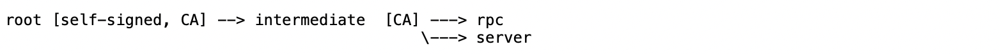

# Deploy TreeGraph

## Download pre-built binaries
Download pre-built binaries from [release](https://github.com/tree-graph/treegraph-release/releases) page on the GitHub repository.

On the ``release`` page, after selecting the corresponding platform, you can click the link to download the zip package. Unzip the package:

* ``conflux_production`` Node program
* ``customized_config.toml`` Node common configure file, i.e. ports for the node to provide rpc service. 
* ``gen_baas_config`` Program used to generate certificates and node specific configure files
* ``log.yaml`` Log configuration file

## Generate certificates and configure files
Get IP addresses for all nodes, i.e. node 1: 172.0.0.1, node 2: 172.0.0.2, ... It is the address of nodes used for other nodes to connect to.

Select P2P port for consortium nodes, i.e. port 15561. It is the TCP port for P2P messages.

Generate certificates and configure files (parameter format for nodes: $IP:$PORT,$IP:$PORT,...):

```bash
./gen_baas_config --nodes $IP:$PORT,$IP:$PORT
```

A folder start with ``Config_`` will be created in current directory:

* ``root, intermediate, rpc, server``: they are certificates, keep them permanently. The certs chain like:



* ``IP_PORT/config.toml``: folders named by IP_PORT contain specific configuration file for each node.


## Copy files to target location
Create a new folder on the target machine, and copy following files into this folder:
* conflux_production
* customized_config.toml
* log.yaml
* config.toml

## Run
Running node via:

```bash
nohup ./conflux_production --customized-config customized_config.toml &
```


## Check status
check conflux_production is running:

```bash
ps -ef | grep conflux_production
```

After all nodes are started, check the latest epoch is growing via rpc or logs.

```bash
curl -X POST --data '{"jsonrpc":"2.0","method":"cfx_epochNumber","params":[],"id":1}' -H "Content-Type: application/json" localhost:$PORT
```

A new directories tree_graph_node will be created in the current working directory to keep the persistent data. Please do not remove them unless data are corrupt or you want to start a fresh new node.

Logs are in directory tree_graph_node/logs
