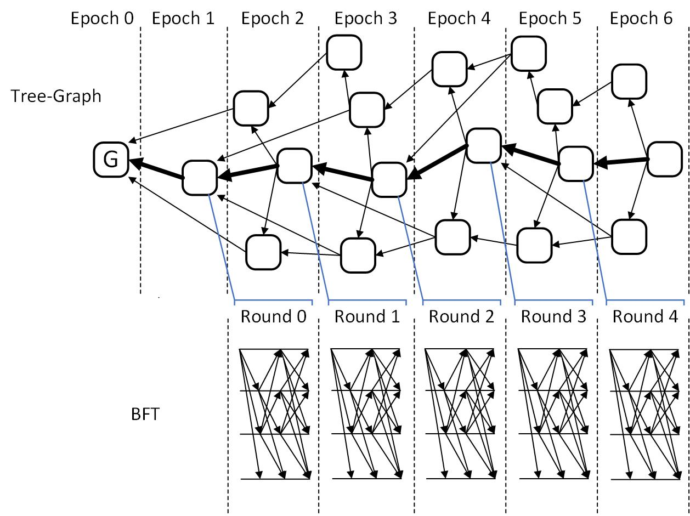

# Conflux Consortium BlockChain
We are pleased to annouce that the Conflux Condortium Blockchain release is arrived. Conflux consortium is permissioned version of Conflux public blockchain. It employs an innovative consensus algorithm combining tree-graph block ledger and BFT protocol to achieve high throughtput and low latency.

The blocks are proposed in parallel by participant nodes and form a tree-graph structure, while the BFT protocol is used to decide the pivot block of each tree-graph epoch. This way, the processes of block generation and block ordering are pipelined. This minimizes the negative effect of BFT latency on system throughput. The following figure illustrates the process.

See [consensus.md](consensus.md) for more about consensus.

## Deployment
See [DEPLOYMENT.md](DEPLOYMENT.md) for deployment steps.

## FAQ
See [FAQ.md](FAQ.md) for the most common troubleshoot questions.

## RPC
See [RPC.md](RPC.md) for RPC methods usage.

## Issue
If you have a bug or an idea, thank you for firing an [issue](https://github.com/tree-graph/conflux-consortium/issues) here.
