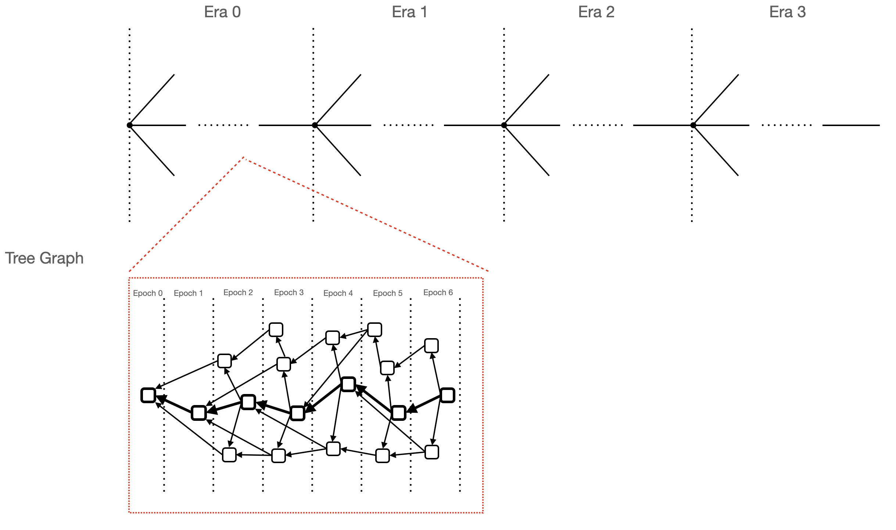

# TreeGraph
TreeGraph consortium blockchain is a rust-based implementation of tree-graph BFT protocol, it uses innovative consensus algorithm and ledger structure to achieve high throughtput and low latency.

The main components are tree-graph layer and consensus layer.

In general, the tree-graph layer generates blocks, sync blocks, and finally organizes blocks into a tree-graph structure through reference relationship between blocks.

The consensus layer selects pivot blocks in the tree-graph structure and form a pivot chain. Based the pivot chain, the total order of all blocks are determined.

## Deployment
See [DEPLOYMENT.md](DEPLOYMENT.md) for deployment steps.

## FAQ
See [FAQ.md](FAQ.md) for the most common troubleshoot questions.

## RPC
See [RPC.md](RPC.md) for RPC methods usage.

## Issue
If you have a bug or an idea, thank you for firing an [issue](https://github.com/tree-graph/treegraph-release/issues) here.