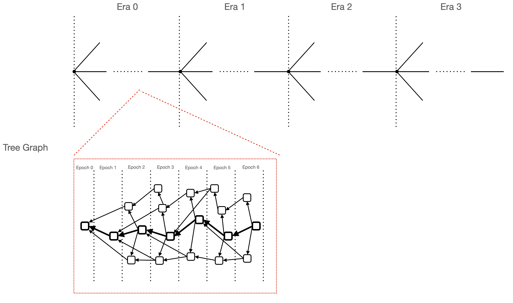

# 共识协议

本文主要介绍了 Tree Graph Protocol 的具体细节。

树图链的共识协议分成两个部分，第一个部分是树图结构的维护，第二个部分是对账本中区块定序。其中第二部分主要是通过另一个共识机制在树图结构中选择一条枢轴链（Pivot Chain），并根据达成共识的枢轴链来确定所有区块的全序关系。

## 树图结构

在树图链中有一个专门的 Consensus Graph 结构来维护树图结构。它接收了来自 Synchronization Graph 的区块，并对这些区块做一些共识校验。



为了兼顾处理速度和内存使用，树图链对树图结构做了一些规定：

1. 在 Consensus Graph 里，我们把所有区块划分成若干 *Epoch*。在 *Pivot Chain* 上的每个区块都对应了一个 *Epoch*，这个区块的高度也被叫做 *Epoch Number*。每个 *Epoch* 中还包含了满足下面条件的区块：
    + 能够从 *Pivot Chain* 上对应区块经过父边或者引用边到达；
    + 没有被包含在上一个 *Epoch* 里。
2. 所有区块按照以下规则定序：
    + 首先将所有区块按照所属的 *Epoch* 进行排序；
    + 对于同一个 *Epoch* 内的区块，按照父边和引用边构成的拓扑序进行排序。
3. 以固定间隔对所有 *Epoch* 进行划分，目前默认是用 50000 作为划分间隔。划分出来的每一段都被称之为一个 *Era*。比如高度 0 到高度 49999 是属于 `Era 0`，高度 50000 到高度 99999 是属于 `Era 2`，依次类推。每个 *Era* 的起点称之为 *Era Genesis*，也称为一个 *Checkpoint*。
4. 任何区块都不能引用不在自己 *Era* 内的区块。更具体的来说，如果区块 `B` 被区块 `A` 引用，那么区块 `B` 和区块 `A` 的父区块必须在同一个 *Era* 内（拥有同一个 *Era Genesis*）。一个块 `X` 所属的 *Era* 的 *Era Genesis* 是这么计算的，令这个块的高度为 `H(X)`，那么在创世块到 `X` 的路径上第 `floor(H(x) / 50000) * 50000` 个块就是 `X` 所属的 *Era* 的 *Era Genesis*。
5. 在 Consensus Graph 中，我们仅会保留最近的两个 *Era*，其他区块都会从内存里面删掉。特别的，对于全节点，区块可能还会从硬盘里删掉。每当 Pivot Chain 变长的时候，我们会检查是否有新的 Era Genesis 形成，如果是的话，则会出发一次 Checkpoint。

## HotStuff 共识协议

在树图链中使用 [HotStuff 共识协议](https://arxiv.org/pdf/1803.05069.pdf) 来选取树图结构的 Pivot Chain，从而对所有区块进行定序。这是一个比较新的拜占庭容错 (BFT) 共识协议，它能够保证树图链满足下面两个性质：

+ Safety Properties：在程序运行中不会进入非预期的状态，即所有的诚实节点都能够同意区块定序，并且正常执行。
+ Liveness Properties：在程序运行中预期状态一定会到达，即整个树图链系统能够持续的对区块定序，以及执行。

### HotStuff 的优势

我们从性能、可靠性、安全性、实现难度以及验证器操作开销几个维度评估了几种基于 BFT 的协议。我们的目标是选择在初期可以支持至少 100 个验证器的协议，并且它能够随着时间的推移演进到可支持 500-1000 个验证器。选择 HotStuff 协议作为 TreeGraph 的基础有三个原因： (i) 简单和模块化; (ii) 方便将共识与执行集成的能力; (iii) 在早期实验中表现良好。

HotStuff 协议分解为安全模块（投票和提交规则）和存活模块（“复活起搏器”）。这种解耦能够让我们独立的开发和实验这两个模块。由于投票和提交规则非常简单，协议安全性易于实现和验证。将执行作为共识的一部分进行集成也是很自然的，这可以避免基于领导的协议的非确定性执行而产生分叉的问题。最后，我们的早期原型也确认了 HotStuff 满足高吞吐量和低交易延迟（独立的检测）。

### 和树图结构的交互

在 Consensus Graph 里，我们提供了若干的 API 供 HotStuff 共识调用。具体来说 HotStuff 共识每一轮主要会产生这几种动作：

+ 提议（Proposal）：通过 Consensus Graph 产生一个 PivotDecision，来确定下一个枢轴链的块
+ 投票（Vote）：根据 Consensus Graph 里的信息，验证收到的 PivotDecision 信息的正确性
+ 提交（Commit）：将已经达成共识的块接到枢轴链上去

#### 提议（Proposal）

HotStuff 共识给 Consensus Graph 提供一个区块 hash `H`，然后 Consensus Graph 会在这个区块 `H` 的儿子里选出一个块当做下一个枢轴链的块。如果区块 `H` 不存在任何儿子的话，Consensus Graph 会尝试生成一个新的块。

之后这个块的信息会被打包成一个 PivotDecision 并发回给 HotStuff 共识，由它将这个提议发给其他验证节点进行验证。其中 PivotDecision 的定义如下：

```rust
pub struct PivotBlockDecision {
    pub height: u64,
    pub block_hash: H256,
    pub parent_hash: H256,
}
```

#### 投票（Vote）

对于收到的 PivotDecision 或者自己生成的 PivotDecision，都需要进行验证，并且至少有 1/3 的节点验证通过。

在 Consensus Graph 里维护了一个结构叫做 CandidatePivotTree，它维护了所有可能在枢轴链上的块，也就是没有被 HotStuff 共识提交的块。这些块构成了一棵树形结构，一个新的 PivotDecision 是合法的当且仅当满足下面几个条件：

1. 父区块 `parent_hash` 存在并且它确实是区块 `block_hash` 的父亲。
2. 区块 `block_hash` 的高度确实是 `height`。
3. 区块 `block_hash` 的区块头内的 State 相关信息都是正确的，包括：`deferred_state_root`，`deferred_receipts_root` 和 `deferred_logs_bloom_hash`。
4. 区块 `parent_hash` 是一个可能在枢轴链上的块，也就是说它应该在 `CandidatePivotTree` 里。
5. 区块 `block_hash` 不在 `CandidatePivotTree` 里，或者它在里面，但是树的结构不发生改变。也就是说在 `CandidatePivotTree` 的父区块的 hash 确实是 `parent_hash`。

对于验证通过的 PivotDecision，我们就会认为是正确的，然后给相关的验证节点发送验证通过的消息。

#### 提交（Commit）

HotStuff 共识也维护了一个 树形结构，表示每次 PivotDecision 的关系，有三个连续轮都不产生分叉，那么我们就认为这个块达成了共识。因此会把这个 PivotDecision 对应的块加到枢轴链链上。让 Consensus Graph 可以进行后续的操作，比如执行。
